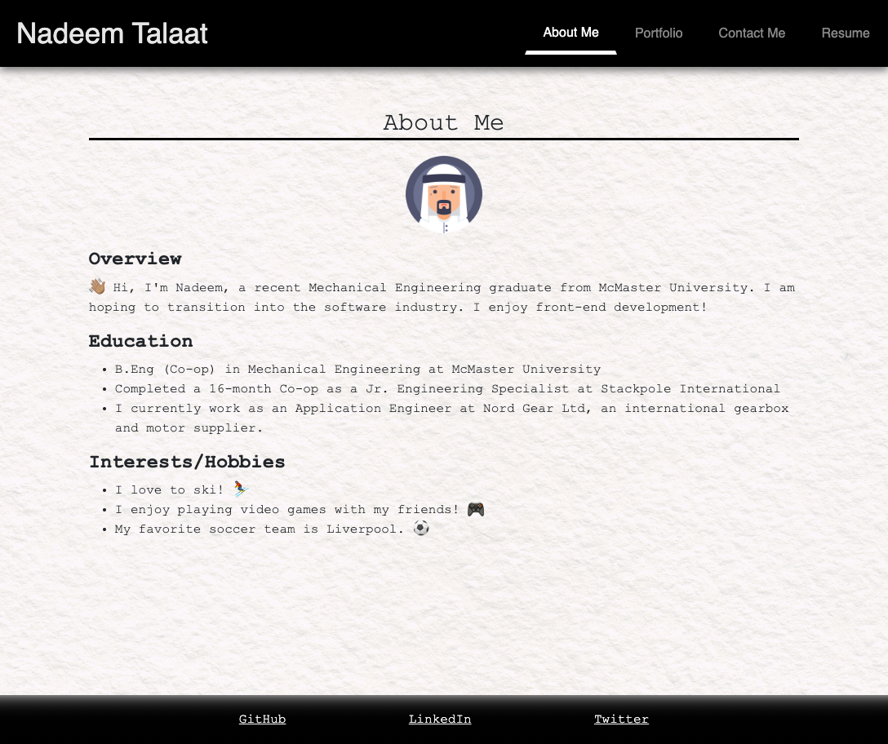

# React Portfolio

## Description

A professional portfolio created using React.

## Table of Contents

- [Installation](#installation)
- [Usage](#usage)
- [Contributing](#contributing)
- [Tests](#tests)
- [License](#license)
- [Questions](#questions)

## Installation

Website can be accessed [here.](https://nadeemtalaat.github.io/React-Portfolio/)

## Usage

At the top right of the page, there is a navigation bar which allows the user to move from page to page.

The 'About Me' page includes my avatar and a small bio about myself.

The 'Portfolio' page includes a list of my projects with links to their repos and deployments.

The 'Contact Me' page includes a form for user input. It validates and prompts the user to enter data or a valid email address.

The 'Resume' page includes a link to download my resume, and some of my proficiencies.

At the bottom of the page, there are links to GitHub, LinkedIn, and Twitter.

## Contributing

Nadeem Talaat

## Tests

N/A

## License

MIT

## Questions

For any questions, please reach out via:

- [GitHub](https://www.github.com/NadeemTalaat)
- [Email](mailto:nadeem.talaat@gmail.com)
